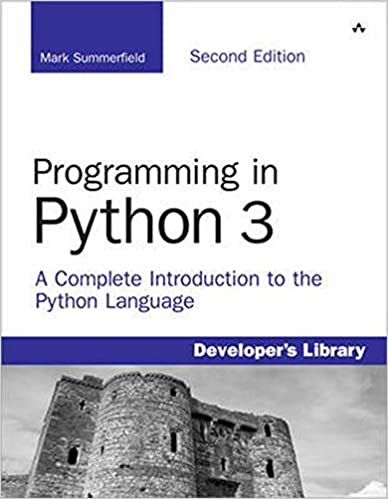
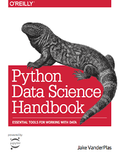

# Intro to Data Science
Notes taken during the Master's degree at UCB "San Pablo".

## Main Books

### 1. Programming in Python 3 by Mark Summerfield

### 2. Python Data Science Handbook by Jake VanderPlas

